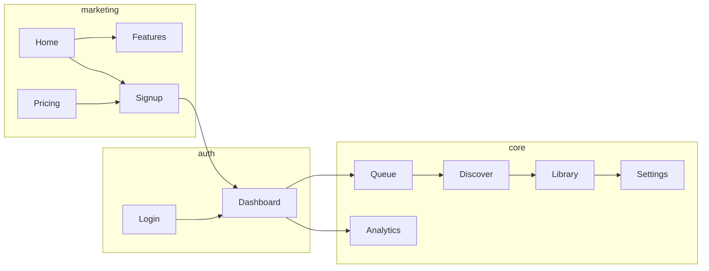

# Jober UI review — production screenshots

> **Polish pack (2026-06-10):** This document drives missions **04–10** and **27–28** in [`docs/polish-pack/`](../polish-pack/mission_index.md). Re-capture screenshots after each user-facing change via `apps/web/scripts/capture-screenshots.mjs`.

**Captured:** 2026-06-10 · **Environment:** production · **Viewport:** 1440×900 · **Count:** 23 full-page PNGs in [`prod/`](prod/)

**North star:** feel like **Hyper Agents** (agent-native, premium dark product), **Figma** (typographic precision, confident whitespace), and **21st.dev** (distinctive components, depth, motion) — not a generic shadcn/Tailwind “vibe coded” shell.

---

## Executive summary

### What’s working

- **Coherent dark system** — consistent navy/charcoal surfaces, readable contrast, monospace terminal accents where it matters.
- **Clear product story** — “human-in-the-loop” and “review before submit” land on marketing pages without jargon overload.
- **Serious app chrome** — split-pane “ops desk” (controls left, live browser right) signals this is a *tool*, not a landing-page wrapper.
- **Information architecture** — marketing funnel → auth → dashboard → queue/discover/library/settings is logical; nav labels match user mental models.

### What reads “generic” today

| Pattern | Where it shows up | Why it feels template-y |
|--------|-------------------|-------------------------|
| Default shadcn card grid | Features, pricing, FAQ | Same border, same radius, same padding on every block |
| Geist + teal eyebrow + blue CTA | All marketing | Correct but indistinguishable from hundreds of AI SaaS landings |
| ~~Floating analytics toast~~ | ~~Nearly every screen~~ | **Closed Mission 04 (2026-06-11):** replaced with one-time bottom sheet + Settings control |
| Identical split layout | All in-app routes | Dashboard, queue, discover, library, search, analytics, settings share the same 40/60 shell |
| Bottom “Describe what you want…” bar | Every in-app page | Feels pasted on; Hyper-style products use **⌘K command palette** + contextual prompts |
| ~~Dev copy in empty states~~ | ~~Queue (`make seed`)~~ | **Closed Mission 05 (2026-06-11):** onboarding empty states + vault dropzone + blog lead |
| ~~Auth on empty void~~ | ~~Login, signup~~ | **Closed Mission 06:** branded auth shell + trust strip — re-capture 11–13 post-deploy |

### Priority upgrade themes (cross-cutting)

1. **Brand layer** — one distinctive visual signature: mesh gradient hero, animated grid, or glass “agent orb” — used sparingly on marketing + auth only.
2. **Layout discipline** — split-pane only on **run/watch** surfaces; other pages get full-width editorial layouts.
3. **Component tiering** — “marketing bento” ≠ “data table” ≠ “terminal” — three distinct component families, not one `Card` everywhere.
4. **Motion with purpose** — staggered hero entrance, live pulse on `LIVE` badge, skeleton loaders, chart draw-in (21st.dev motion catalog).
5. **Empty states as onboarding** — illustrated steps, primary CTA, sample data toggle (Figma-style “try sample file”).
6. **Consent UX** — bottom sheet once per device, not a persistent toast over product UI. *(Shipped Mission 04 — re-capture screenshots post-deploy to verify.)*

---

## Per-screenshot review

### 01 — Home (`01-home.png`)

**What it is:** Linear-style centered hero with animated run-console preview, trust strip, review-first bento, stepper how-it-works, founder proof, pricing + FAQ teasers.

**Closed Mission 07 (2026-06-11):** §18 structure implemented; placeholder testimonials removed; `ProductVisual` loop + fill-diff bento; larger nav type. Re-capture `01-home.png` post-deploy.

**Remaining**

- Consent sheet may overlap footer CTA until post-deploy re-capture confirms Mission 04 layout.
- Video capture of real run console (optional upgrade over animated terminal).

---

### 02 — Features (`02-features.png`)

**What it is:** Six feature cards in 2×3 grid + bottom CTA.

**UX / flow:** Scannable for evaluators comparing to auto-apply bots. Bullets help skimmers.

**Issues**

- Every card same height/icon treatment — reads like Notion database gallery.
- Icons are outline Lucide at low contrast — don’t anchor memory.
- No deep links into in-app equivalents (e.g. “Live-watch canvas” → demo GIF).

**Upgrade**

- **Bento grid:** make “Live-watch canvas” 2×2, others 1×1 (21st.dev layout).
- **Show, don’t tell:** embed 8s loop of run console inside the large card.
- **Figma-style specs:** add tiny mono labels (`SSE · screenshots · checkpoints`) under feature titles.

---

### 03 — How it works (`03-how-it-works.png`)

**What it is:** Four-step horizontal timeline + FAQ accordion + CTA.

**UX / flow:** Reinforces trust narrative; FAQ reduces sales friction.

**Issues**

- Steps 1–4 equal weight — step 3 (watch/review) should dominate visually.
- FAQ accordion styling identical to pricing/FAQ page — fine, but no progress connector between steps.

**Upgrade**

- Horizontal **stepper with connecting gradient line** and numbered mono badges.
- Step 3 card contains **mini browser chrome** screenshot.
- Animate step highlight on scroll (`intersection observer`).

---

### 04 — Pricing (`04-pricing.png`)

**What it is:** Free vs Pro (coming soon) tiers, BYOK explainer, billing FAQ.

**UX / flow:** Honest “coming soon” avoids trust hit. Limits mirror settings — good consistency.

**Issues**

- Two cards same visual weight though Pro isn’t purchasable — consider ghosted Pro with waitlist email.
- `$0` / “Coming soon” typography feels default — no price anchoring drama.
- Checklist bullets use same green checks as every SaaS template.

**Upgrade**

- **Figma pricing reference:** large price numeral, small `/mo`, feature table below cards not inside.
- **Pro waitlist:** inline email capture instead of dead card.
- Subtle **glow border** on Free “Start free” card (21st.dev `border-beam` pattern).

---

### 05 — FAQ (`05-faq.png`)

**What it is:** Accordion list + CTA (screenshot is lower portion of page).

**UX / flow:** “Straight answers” tone matches brand; questions cover real objections.

**Issues**

- Long accordion list with no category tabs (Billing / Privacy / Product).
- Plus icons only — no expand animation cue.

**Upgrade**

- Split into **two columns** on desktop: Product | Trust & billing.
- Replace `+` with chevron rotation on open; add `max-height` transition.
- Link each answer to anchor on privacy/terms where relevant.

---

### 06 — Blog index (`06-blog.png`)

**What it is:** Single post list (“Markdown-driven posts until CMS”).

**UX / flow:** Minimal blog — fine for pre-launch.

**Issues**

- One post feels empty; meta line about CMS is **internal dev copy** on a public page.
- No featured image, date, or read time.

**Upgrade**

- Hide CMS meta; show **editorial card** with gradient thumbnail even for one post.
- Add newsletter capture (Figma blog pattern).

---

### 07 — Blog post (`07-blog-welcome-to-jober.png`)

**What it is:** Welcome post prose page.

**Issues**

- Prose width OK but no author/byline visual.
- Feels like docs, not editorial.

**Upgrade**

- Narrow measure (`max-w-prose`), drop cap or lead paragraph style.
- “Back to blog” sticky subnav on scroll.

---

### 08–10 — Legal (`08-privacy.png`, `09-terms.png`, `10-acceptable-use.png`)

**What it is:** Long-form legal markdown pages.

**UX / flow:** Required compliance; table of contents would help.

**Issues**

- Wall of text; section IDs exist but no sticky TOC.
- Same marketing chrome — good — but body typography is dense.

**Upgrade**

- **Two-column layout:** sticky TOC left (Figma legal pages).
- Progress indicator in header while scrolling.
- Not a design priority vs product surfaces.

---

### 11 — Login (`11-login.png`)

**What it is:** Sign-in form in branded two-zone auth shell.

**UX / flow:** Email/password + forgot link + signup cross-link; Google when `NEXT_PUBLIC_GOOGLE_OAUTH_ENABLED`.

**Closed Mission 06 (2026-06-11):** split layout with `ProductVisual` brand panel, trust strip, unified error alerts. Re-capture screenshot post-deploy.

**Remaining**

- Consent sheet on auth routes (defer to post-session — Mission 04 follow-up).
- Google button only when OAuth enabled in env.

---

### 12 — Signup (`12-signup.png`)

**What it is:** Register form with value bullets and password strength meter.

**Closed Mission 06 (2026-06-11):** shared auth shell, honest “no verification required” subtitle, password meter. Re-capture post-deploy.

---

### 13 — Forgot password (`13-forgot-password.png`)

**What it is:** Reset request with honest success state (no false email promise until Mission 11).

**Closed Mission 06 (2026-06-11):** designed success UI; copy notes email not live. Re-capture post-deploy.

---

### 14 — Dashboard (`14-dashboard.png`)

**What it is:** Ops overview — metric tiles, recent events, worker pool, batch control, failure analytics; right pane = idle live view.

**UX / flow:** Power-user command center. Metrics communicate system health at a glance.

**Issues**

- **Layout overload:** metrics + events + worker + batch + failure + global AI bar + idle browser = cognitive noise for new users.
- All metrics `0` — empty state doesn’t onboard (“import spreadsheet” path missing here).
- “Start dry-run batch” without context is scary for first visit.
- Bottom prompt bar consumes ~120px on every page.

**Upgrade (highest ROI in-app)**

- **First-run mode:** if queue empty, replace dashboard with **guided checklist** (upload resume → import jobs → launch dry run).
- Move AI prompt to **⌘K palette**; show slim “Ask Jober…” hint chip instead.
- Right pane: show **product tour video** when idle, not empty mailbox.
- Metric tiles: sparklines, subtle `tabular-nums`, hover drill-down (Figma analytics tiles).
- `LIVE` badge: pulse animation + tooltip “connected to worker”.

---

### 15 — Queue (`15-queue.png`)

**What it is:** Job target table/board, import/export, filters.

**UX / flow:** Core workflow surface for spreadsheet-driven users.

**Issues**

- ~~Empty copy references `make seed`~~ — fixed Mission 05; re-capture screenshot post-deploy.
- Table headers float in a void — no illustration for import.
- Board/Table toggle is easy to miss.

**Upgrade**

- Empty: **drag-drop zone** for XLSX front and center (Hyper file-upload panels).
- Sample template download button.
- Sticky toolbar; zebra rows; company logo column when available.
- Board view: kanban by status with lane colors (not only table).

---

### 16 — Discover (`16-discover.png`)

**What it is:** Job search form + saved lists + batch launch — dense left column.

**UX / flow:** Power feature but visually busiest page.

**Issues**

- Too many bordered boxes nested — “boxes in boxes” vibe-coded pattern.
- Search fields equal weight — no primary “Role” field emphasis.
- Right pane idle duplicates other pages exactly.

**Upgrade**

- **Progressive disclosure:** collapse “Saved lists” until first search.
- Single **primary card** for search; secondary actions in overflow menu.
- Preset chips: “Staff eng remote”, “Series B hybrid” (21st.dev chip row).
- On search results (not in screenshot): split results list in left / preview right.

---

### 17–20 — Library tabs (`17-library-resumes.png` … `20-library-runs.png`)

**What it is:** Asset library — resumes, letters, jobs, runs tabs.

**UX / flow:** Correct tab model; empty states explain each asset type.

**Issues**

- Four screenshots look **nearly identical** — tab pill change only.
- Upload resume is a small button; should be hero action when empty.
- Cover letters tab has filter input but no rows — filter feels premature.

**Upgrade**

- **Empty tab illustrations** per asset type (custom SVG, not Lucide-in-box).
- Resumes: large dropzone + “Set as canonical” badge on uploaded file.
- Runs: timeline layout preview (skeleton rows) even when empty.
- Consider **combining** library + search into one “Assets” hub with sidebar nav (Figma file browser).

---

### 21 — Search (`21-search.png`)

**What it is:** Global workspace search input.

**Issues**

- Entire page for one input — inefficient; should be modal/⌘K.
- Duplicate idle right pane again.

**Upgrade**

- Deprecate full-page route; use **command palette** overlay from any screen.
- If keeping page: show recent searches, filters, and result categories below input.

---

### 22 — Analytics (`22-analytics.png`)

**What it is:** User metrics — applications, responses, letters, LLM cost; chart placeholders.

**UX / flow:** Good trust message (“first-party only”).

**Issues**

- Charts say “No data” — flat gray voids.
- 7d/30d/90d toggles are plain buttons.
- “Product (admin)” tab exists in code but not visible for normal user — OK.

**Upgrade**

- **Empty charts:** show ghost bars + “Run your first application” CTA overlay (Figma empty analytics).
- Use **recharts** with gradient fills and proper axes when data exists.
- Export CSV as secondary text button, not competing blue link.

---

### 23 — Settings (`23-settings.png`)

**What it is:** Profile vault completeness, resume upload, usage meters, AI/appearance/security sections (scroll).

**UX / flow:** 0% completeness is a strong activation hook.

**Issues**

- “Drop your job spreadsheet here” under **Canonical resume** — wrong copy (bug-level UX).
- Completeness checklist is long and intimidating at 0%.
- Settings in scroll with split pane — hard to scan.

**Upgrade**

- Fix copy mismatch immediately.
- **Grouped nav:** Profile | AI | Security | Billing (left subnav like Figma settings).
- Completeness: show **3 required** vs optional; celebrate partial progress.
- Resume upload: show file card with parse status spinner.

---

## User flows (end-to-end)

| Flow | Status in screenshots | Gap |
|------|----------------------|-----|
| Land → understand → signup | ✅ Marketing complete | Needs stronger hero motion + proof |
| Signup → first value < 5 min | ⚠️ Dashboard empty | No guided onboarding path |
| Import jobs → queue | ⚠️ Queue empty | Dev copy; no drag-drop |
| Discover → add to list → batch | ⚠️ Form only | No results state captured |
| Upload resume → vault % | ⚠️ Settings 0% | Wrong dropzone copy |
| Run → watch → review → submit | ❌ Not captured | No active run / checkpoint UI |
| Analytics after usage | ⚠️ Empty charts | Need seed data or demo mode |

**Recommendation:** add a **“demo workspace”** toggle (like Figma templates) for screenshots and evaluators — populates queue, charts, and run console with sanitized fixture data.

---

## Design system upgrades (to escape “generic”)

### Typography

| Today | Target |
|-------|--------|
| Geist everywhere | Geist Sans body + **Geist Mono** for labels, metrics, terminal |
| Similar heading sizes | Clear 4-step scale: `display / h1 / h2 / caption` with explicit line-heights |
| Default bold headlines | Weight 600 + tight tracking on marketing display |

### Color & depth

| Today | Target |
|-------|--------|
| Flat `bg-card/80` + `border-border/60` | Layered surfaces: `bg-background` → `surface-1` → `surface-2` |
| Single blue primary | Primary + **accent mint** (already in eyebrow) wired into CTAs, focus rings, chart fills |
| No atmosphere | One **hero gradient mesh** + optional noise overlay (`opacity-5`) |

### Components (21st.dev-inspired)

- `MagicCard` / border beam on primary CTA cards only — not every card.
- `AnimatedGridPattern` behind hero mockup.
- `NumberTicker` for dashboard metrics when values change.
- `ShimmerButton` for single primary action per viewport.
- Command palette (`cmdk` already in deps) replacing persistent bottom chat bar.

### Layout rules

1. **Marketing** — max-width 1200px, generous `py-24` sections, bento variation.
2. **App list pages** (queue, library) — full width left; hide live pane until run exists.
3. **Run/watch** — split pane mandatory; terminal bottom dock.
4. **Settings** — single column 720px, no live pane.

---

## Prioritized roadmap

### P0 — Quick wins (1–3 days)

- [ ] Remove `make seed` and CMS meta from user-visible copy.
- [ ] Fix settings resume dropzone copy (“PDF or DOCX” not spreadsheet).
- [ ] Consent banner: corner → bottom sheet; remember choice; don’t show on auth.
- [ ] Login/signup Google button parity if OAuth configured.
- [ ] Hide bottom AI bar on pages where it’s non-functional noise; expose ⌘K.

### P1 — Onboarding & demo (1 week)

- [ ] First-run checklist on dashboard (empty queue).
- [ ] Queue/library empty states with drag-drop + template XLSX.
- [ ] `?demo=1` or “Explore demo workspace” with fixture data for charts/runs.
- [ ] Capture **active run** screenshots once demo mode exists.

### P2 — Marketing polish (1–2 weeks)

- [ ] Hero bento + motion loop in mockup.
- [ ] Distinct feature grid sizing; embed console GIF in features page.
- [ ] Split auth layout with brand panel.
- [ ] Social proof row with avatars/logos.

### P3 — Product-grade shell (2–4 weeks)

- [ ] Layout refactor: live pane only on dashboard/runs routes.
- [ ] Settings subnav + section scroll spy.
- [ ] Command palette as primary AI entry.
- [ ] Chart + metric design pass (analytics, dashboard).
- [ ] Design token pass: surfaces, mono labels, motion tokens in `globals.css`.

---

## Reference mood board

| Reference | Steal this |
|-----------|------------|
| **Hyper Agents** | Agent-native density, live status, premium dark chrome, contextual AI (not always-visible chat) |
| **Figma** | Typographic rhythm, settings IA, empty states that teach, keyboard-first patterns |
| **21st.dev** | Bento hero, border glow, animated grids, distinctive buttons — **one accent component per view max** |
| **Linear** | Mono metadata, keyboard hints, flat hierarchy with sharp priorities |
| **Raycast** | Command palette as home for actions + AI |

---

## Files & tooling

- Screenshots: [`docs/screenshots/prod/*.png`](prod/)
- Index: [`docs/screenshots/README.md`](README.md)
- Regenerate: `apps/web/scripts/capture-screenshots.mjs`
- Design tokens: `apps/web/src/lib/design/tokens.ts`, `apps/web/src/app/globals.css`

**Not captured (follow-up):** admin suite (`/admin/*`), active run console with browser stream, checkpoint review modal, mobile breakpoints, light mode (if planned).
